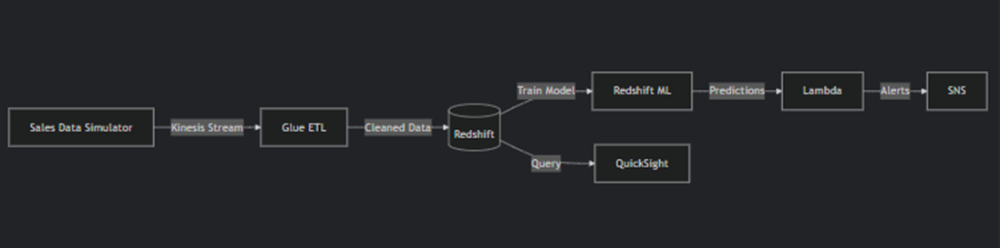

# Ecom Stockout Predictor

## Problem Statement

E-commerce businesses face three major challenges:
1. **Delayed stockout detection:** Traditional analytics take hours or days to process, missing real-time sales trends.
2. **Manual inventory forecasting:** Teams rely on spreadsheets, leading to overstocking or stockouts.
3. **High AWS costs:** Complex pipelines can easily exceed free-tier limits if not optimized.

**Goal:**  
Build a real-time analytics pipeline that:
- ✔ Processes live sales data
- ✔ Predicts stockouts using ML
- ✔ Runs entirely on AWS Free Tier
- ✔ Delivers insights with less than 5 minutes latency

---

## Solution

### 1. Data Ingestion (Kinesis)
- Simulate real-time sales data (Python script → Kinesis)
- Free Tier: 1 shard @ 1MB/s (sufficient for demo)

### 2. ETL (Glue PySpark - Serverless)
- Deduplicate, clean, and aggregate sales data
- Feature engineering (rolling sales averages, product trends)
- Cost Saver: Use Glue Bookmarks to avoid reprocessing

### 3. Predictive Inventory (Redshift ML)
- Train a simple demand-forecasting model (ARIMA or Linear Regression)
- Predict stockouts based on sales velocity
- Free Tier: Redshift Serverless (up to 8 hours/day)

### 4. Serverless Alerting (Lambda + SNS)
- Trigger alerts when stockout risk >80%
- Send email/SMS via SNS (Free Tier: 1M requests/month)

### 5. Dashboard (QuickSight)
- Visualize real-time sales vs. predictions
- Highlight at-risk products

---

## Quick Start

1. **Provision AWS resources** using Terraform.
2. **Simulate sales data** with the provided Python script.
3. **Run ETL jobs** in AWS Glue.
4. **Train and deploy ML model** in Redshift.
5. **Configure Lambda alerts** for stockout risks.
6. **Visualize results** in QuickSight.

See [`docs/SETUP.md`](docs/SETUP.md) for detailed instructions.

---

##